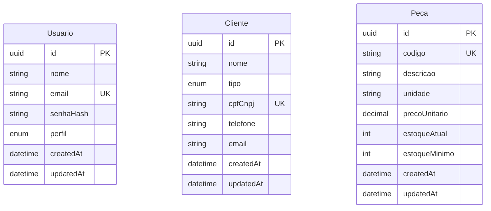
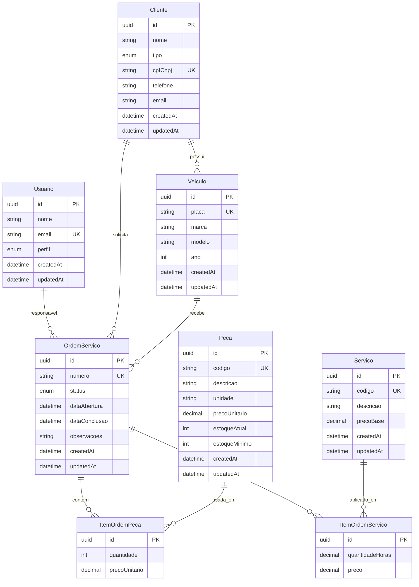

# Modelo Conceitual — Banco de Dados

**Versão:** 1.2.0  
**Data:** 2026-06-16  
**Status:** Documentação conceitual (sem implementação física neste artefato)

---

## 1. Objetivo e notação

Este documento descreve o **modelo conceitual** (MER/DER) do ERP de oficina mecânica em duas visões:

| Visão | Entidades | Relacionamentos |
|-------|-----------|-----------------|
| **MVP** | `Usuario`, `Cliente`, `Peca` | Nenhum (entidades independentes) |
| **Estendida** | + `Veiculo`, `Servico`, `OrdemServico`, entidades associativas | 1:N e N:N |

> **Importante:** não há sprint ou cronograma formal definido para este projeto neste momento. O MVP reflete o escopo mínimo atual da documentação (SRS, ADR-003); a visão estendida é evolução conceitual futura, sem prazo definido.

### Notação ER utilizada

- **Entidade forte** — objeto de negócio com identificador próprio (PK).
- **Atributo** — propriedade de uma entidade; opcional indicado na tabela.
- **PK** — chave primária (`UUID v4`).
- **UK** — chave única (restrição de unicidade).
- **Cardinalidade** — `1:1`, `1:N`, `N:N` (e `(min,max)` quando aplicável).
- **Entidade associativa** — resolve N:N e pode ter atributos próprios (ex.: quantidade na OS).

Diagramas em **Mermaid `erDiagram`** (renderizam no GitHub e em editores compatíveis).

### Restrições globais

- Todas as PKs são **UUID v4** (ADR-001, SRS §2.3).
- Timestamps armazenados em **UTC** (SRS §2.3).
- Autenticação JWT é **camada de aplicação** — não é entidade persistida.

---

## 2. MVP

Três entidades **independentes**. Não há relacionamentos entre `Cliente`, `Peca` e `Usuario` neste escopo (README, ADR-003).

### 2.1 Diagrama — MVP

### 2.2 Entidade `Usuario`

| Atributo | Tipo | Restrição | Descrição |
|----------|------|-----------|-----------|
| `id` | UUID | PK | Identificador único |
| `nome` | String | Obrigatório | Nome do usuário |
| `email` | String | UK, obrigatório | Login; único no sistema |
| `senhaHash` | String | Obrigatório | Hash bcrypt (nunca texto puro) |
| `perfil` | Perfil | Obrigatório | `GERENTE` ou `FUNCIONARIO` |
| `createdAt` | DateTime | Obrigatório | Criação (UTC) |
| `updatedAt` | DateTime | Obrigatório | Última alteração (UTC) |

### 2.3 Entidade `Cliente`

| Atributo | Tipo | Restrição | Descrição |
|----------|------|-----------|-----------|
| `id` | UUID | PK | Identificador único |
| `nome` | String | Obrigatório | Nome ou razão social |
| `tipo` | TipoCliente | Obrigatório | `PF` ou `PJ` |
| `cpfCnpj` | String | UK, obrigatório | Documento; único no sistema |
| `telefone` | String | Opcional | Contato |
| `email` | String | Opcional | Contato |
| `createdAt` | DateTime | Obrigatório | Criação (UTC) |
| `updatedAt` | DateTime | Obrigatório | Última alteração (UTC) |

### 2.4 Entidade `Peca`

| Atributo | Tipo | Restrição | Descrição |
|----------|------|-----------|-----------|
| `id` | UUID | PK | Identificador único |
| `codigo` | String | UK, obrigatório | Código interno; único no sistema |
| `descricao` | String | Obrigatório | Descrição da peça |
| `unidade` | String | Obrigatório | Unidade de medida (ex.: UN, CX) |
| `precoUnitario` | Decimal(10,2) | Obrigatório | Preço de venda |
| `estoqueAtual` | Int | Obrigatório | Quantidade em estoque |
| `estoqueMinimo` | Int | Obrigatório | Limite para alerta |
| `createdAt` | DateTime | Obrigatório | Criação (UTC) |
| `updatedAt` | DateTime | Obrigatório | Última alteração (UTC) |

### 2.5 Domínios de atributos (MVP)

| Domínio | Valores |
|---------|---------|
| **Perfil** | `GERENTE`, `FUNCIONARIO` |
| **TipoCliente** | `PF`, `PJ` |

### 2.6 Regras de negócio (MVP)

| Regra | Fonte |
|-------|-------|
| `email` de usuário único | ADR-003 |
| `cpfCnpj` único; duplicata → HTTP 409 | SRS RF-CLI-001 |
| `codigo` de peça único; duplicata → HTTP 409 | SRS RF-PEC-001 |
| Estoque crítico: `estoqueAtual < estoqueMinimo` (atributo derivado, sem coluna extra) | METRICS.md |
| JWT de autenticação não é persistido no banco | Camada de aplicação |

### 2.7 Relacionamentos (MVP)

**Nenhum.** As três entidades não possuem FKs entre si neste escopo.

---

## 3. Visão estendida (conceitual)

Modelo completo para o domínio de oficina mecânica, incluindo veículos, ordens de serviço e catálogo de serviços. **Somente documentação** — sem implementação definida.

### 3.1 Diagrama — visão estendida

### 3.2 Entidades adicionais

#### `Veiculo`

| Atributo | Tipo | Restrição |
|----------|------|-----------|
| `id` | UUID | PK |
| `clienteId` | UUID | FK → Cliente |
| `placa` | String | UK |
| `marca` | String | Obrigatório |
| `modelo` | String | Obrigatório |
| `ano` | Int | Obrigatório |
| `createdAt`, `updatedAt` | DateTime | Obrigatórios |

#### `Servico`

| Atributo | Tipo | Restrição |
|----------|------|-----------|
| `id` | UUID | PK |
| `codigo` | String | UK |
| `descricao` | String | Obrigatório |
| `precoBase` | Decimal(10,2) | Obrigatório |
| `createdAt`, `updatedAt` | DateTime | Obrigatórios |

#### `OrdemServico`

| Atributo | Tipo | Restrição |
|----------|------|-----------|
| `id` | UUID | PK |
| `clienteId` | UUID | FK → Cliente |
| `veiculoId` | UUID | FK → Veiculo |
| `usuarioId` | UUID | FK → Usuario (responsável) |
| `numero` | String | UK |
| `status` | StatusOrdemServico | Obrigatório |
| `dataAbertura` | DateTime | Obrigatório |
| `dataConclusao` | DateTime | Opcional |
| `observacoes` | String | Opcional |
| `createdAt`, `updatedAt` | DateTime | Obrigatórios |

#### `ItemOrdemPeca` (entidade associativa)

| Atributo | Tipo | Restrição |
|----------|------|-----------|
| `id` | UUID | PK |
| `ordemServicoId` | UUID | FK → OrdemServico |
| `pecaId` | UUID | FK → Peca |
| `quantidade` | Int | Obrigatório |
| `precoUnitario` | Decimal(10,2) | Obrigatório (snapshot na OS) |

#### `ItemOrdemServico` (entidade associativa)

| Atributo | Tipo | Restrição |
|----------|------|-----------|
| `id` | UUID | PK |
| `ordemServicoId` | UUID | FK → OrdemServico |
| `servicoId` | UUID | FK → Servico |
| `quantidadeHoras` | Decimal(10,2) | Obrigatório |
| `preco` | Decimal(10,2) | Obrigatório (snapshot na OS) |

### 3.3 Domínio adicional

| Domínio | Valores |
|---------|---------|
| **StatusOrdemServico** | `ABERTA`, `EM_ANDAMENTO`, `CONCLUIDA`, `CANCELADA` |

### 3.4 Relacionamentos e cardinalidades

| Relacionamento | Cardinalidade | Descrição |
|----------------|---------------|-----------|
| Cliente → Veiculo | **1:N** `(1,N)` — `(1,1)` | Um cliente possui vários veículos |
| Cliente → OrdemServico | **1:N** `(1,N)` — `(1,1)` | Histórico de OS por cliente |
| Veiculo → OrdemServico | **1:N** `(1,N)` — `(1,1)` | Cada OS refere um veículo |
| Usuario → OrdemServico | **1:N** `(1,N)` — `(1,1)` | Mecânico/responsável pela OS |
| OrdemServico ↔ Peca | **N:N** | Via `ItemOrdemPeca` |
| OrdemServico ↔ Servico | **N:N** | Via `ItemOrdemServico` |

### 3.5 N:N e entidades associativas

| Relacionamento | Entidade associativa | Atributos próprios |
|----------------|----------------------|--------------------|
| OrdemServico ↔ Peca | `ItemOrdemPeca` | `quantidade`, `precoUnitario` |
| OrdemServico ↔ Servico | `ItemOrdemServico` | `quantidadeHoras`, `preco` |

Sem entidade associativa, não é possível registrar quantidade e preço por item sem violar normalização.

### 3.6 Restrição de integridade

O `veiculoId` de uma `OrdemServico` deve referenciar um `Veiculo` cujo `clienteId` coincide com o `clienteId` da mesma OS. Validação futura na aplicação ou constraint composta no modelo lógico.

### 3.7 Fora do escopo (SRS §1.2)

Financeiro, fiscal, agenda, operação offline, integrações externas — não modelados.

---

## 4. Mapeamento MVP → estendido

| Entidade MVP | Status na visão estendida | Alterações futuras |
|--------------|---------------------------|--------------------|
| `Usuario` | Mantida | Ganha FK **1:N** com `OrdemServico` |
| `Cliente` | Mantida | Ganha FK **1:N** com `Veiculo` e `OrdemServico` |
| `Peca` | Mantida | Ganha **N:N** com `OrdemServico` via `ItemOrdemPeca` |
| `Veiculo` | Nova | FK → Cliente |
| `Servico` | Nova | Catálogo independente |
| `OrdemServico` | Nova | FKs → Cliente, Veiculo, Usuario |
| `ItemOrdemPeca` | Nova | Associativa OS ↔ Peca |
| `ItemOrdemServico` | Nova | Associativa OS ↔ Servico |

---

## 5. Decisões de modelagem (conceitual)

| # | Lacuna | Decisão adotada |
|---|--------|-----------------|
| 1 | `Usuario.updatedAt` ausente no ADR-003 | Incluído para consistência com `Cliente` e `Peca` |
| 2 | Precisão de `precoUnitario` | `Decimal(10, 2)` no domínio monetário |
| 3 | `unidade` como texto livre | Mantido como texto no MVP; enum futuro se necessário |
| 4 | Permissões do Funcionário (SRS vs USE_CASES) | Tratado na API, não no modelo |
| 5 | Validação de CPF/CNPJ | Unicidade no modelo; formato na validação de entrada |
| 6 | Delete de registros | Exclusão física concebida; sem `deletedAt` no MVP |
| 7 | Integridade OS-Cliente-Veículo | Regra de negócio documentada na visão estendida |

---

## 6. Referências

- [ADR-001 — UUID como identificador](../architecture/ADR-001-uuid-como-identificador.md)
- [ADR-003 — PostgreSQL banco único](../architecture/ADR-003-postgresql-banco-unico.md)
- [SRS](../project/SRS.md)
- [USE_CASES](../project/USE_CASES.md)
- [METRICS](../project/METRICS.md)
- [Modelo físico MySQL](../../database/mysql/) — scripts `schema_mvp.sql` e `schema_extended.sql`
- [Checklist de apresentação](CHECKLIST-APRESENTACAO.md)
