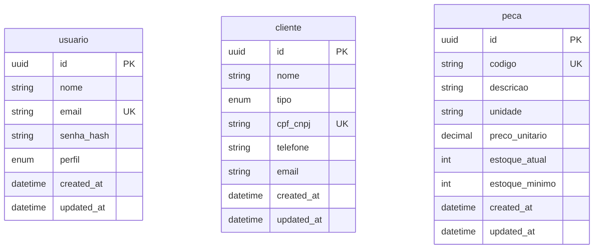
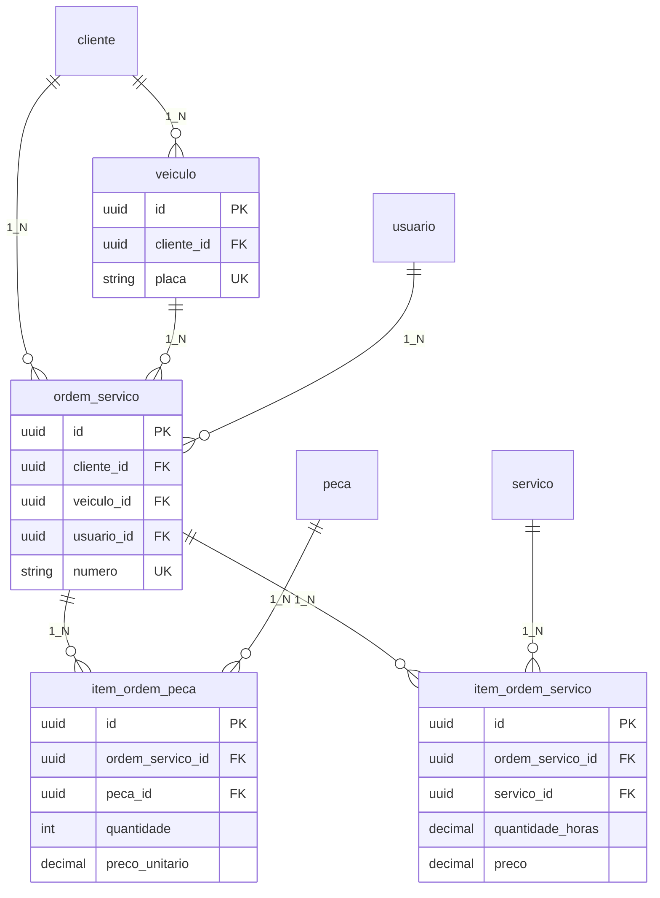

# Modelo Lógico — Banco de Dados

**Versão:** 1.0.0  
**Data:** 2026-06-16  
**Domínio:** ERP Oficina Mecânica

O modelo lógico traduz o [modelo conceitual](MODELO-CONCEITUAL.md) ao paradigma relacional: tabelas, colunas, chaves primárias (PK), chaves estrangeiras (FK) e chaves únicas (UK).

**Implementação física:** [`database/mysql/schema_mvp.sql`](../../database/mysql/schema_mvp.sql) (MVP) e [`schema_extended.sql`](../../database/mysql/schema_extended.sql) (estendido).

---

## 1. Visão geral

| Visão | Tabelas | FKs |
|-------|---------|-----|
| **MVP** | 3 | 0 |
| **Estendida** | 8 | 8 |

Convenções lógicas:

- Nomes de tabela em `snake_case`
- PK: `id` (UUID)
- Timestamps: `created_at`, `updated_at`

---

## 2. Modelo lógico MVP

Três tabelas independentes — sem relacionamentos (FK).

### 2.1 Diagrama relacional — MVP

### 2.2 Tabelas MVP

#### `usuario`

| Coluna | Tipo lógico | PK | UK | Nullable |
|--------|-------------|----|----|----------|
| `id` | UUID | PK | | N |
| `nome` | VARCHAR(150) | | | N |
| `email` | VARCHAR(255) | | UK | N |
| `senha_hash` | VARCHAR(255) | | | N |
| `perfil` | ENUM(GERENTE, FUNCIONARIO) | | | N |
| `created_at` | DATETIME | | | N |
| `updated_at` | DATETIME | | | N |

#### `cliente`

| Coluna | Tipo lógico | PK | UK | Nullable |
|--------|-------------|----|----|----------|
| `id` | UUID | PK | | N |
| `nome` | VARCHAR(150) | | | N |
| `tipo` | ENUM(PF, PJ) | | | N |
| `cpf_cnpj` | VARCHAR(14) | | UK | N |
| `telefone` | VARCHAR(20) | | | Y |
| `email` | VARCHAR(255) | | | Y |
| `created_at` | DATETIME | | | N |
| `updated_at` | DATETIME | | | N |

#### `peca`

| Coluna | Tipo lógico | PK | UK | Nullable |
|--------|-------------|----|----|----------|
| `id` | UUID | PK | | N |
| `codigo` | VARCHAR(50) | | UK | N |
| `descricao` | VARCHAR(255) | | | N |
| `unidade` | VARCHAR(20) | | | N |
| `preco_unitario` | DECIMAL(10,2) | | | N |
| `estoque_atual` | INT | | | N |
| `estoque_minimo` | INT | | | N |
| `created_at` | DATETIME | | | N |
| `updated_at` | DATETIME | | | N |

---

## 3. Modelo lógico estendido

Oito tabelas com relacionamentos 1:N e N:N (via associativas).

### 3.1 Diagrama relacional — estendido

### 3.2 Tabelas estendidas (novas e alterações)

As tabelas `usuario`, `cliente` e `peca` mantêm a mesma estrutura lógica do MVP.

#### `veiculo`

| Coluna | Tipo lógico | PK | FK | UK | Nullable |
|--------|-------------|----|----|-----|----------|
| `id` | UUID | PK | | | N |
| `cliente_id` | UUID | | FK → `cliente.id` | | N |
| `placa` | VARCHAR(10) | | | UK | N |
| `marca` | VARCHAR(80) | | | | N |
| `modelo` | VARCHAR(80) | | | | N |
| `ano` | INT | | | | N |
| `created_at` | DATETIME | | | | N |
| `updated_at` | DATETIME | | | | N |

#### `servico`

| Coluna | Tipo lógico | PK | UK | Nullable |
|--------|-------------|----|-----|----------|
| `id` | UUID | PK | | N |
| `codigo` | VARCHAR(50) | | UK | N |
| `descricao` | VARCHAR(255) | | | N |
| `preco_base` | DECIMAL(10,2) | | | N |
| `created_at` | DATETIME | | | N |
| `updated_at` | DATETIME | | | N |

#### `ordem_servico`

| Coluna | Tipo lógico | PK | FK | UK | Nullable |
|--------|-------------|----|----|-----|----------|
| `id` | UUID | PK | | | N |
| `cliente_id` | UUID | | FK → `cliente.id` | | N |
| `veiculo_id` | UUID | | FK → `veiculo.id` | | N |
| `usuario_id` | UUID | | FK → `usuario.id` | | N |
| `numero` | VARCHAR(20) | | | UK | N |
| `status` | ENUM(ABERTA, EM_ANDAMENTO, CONCLUIDA, CANCELADA) | | | | N |
| `data_abertura` | DATETIME | | | | N |
| `data_conclusao` | DATETIME | | | | Y |
| `observacoes` | TEXT | | | | Y |
| `created_at` | DATETIME | | | | N |
| `updated_at` | DATETIME | | | | N |

#### `item_ordem_peca` (associativa N:N OS ↔ Peca)

| Coluna | Tipo lógico | PK | FK | UK | Nullable |
|--------|-------------|----|----|-----|----------|
| `id` | UUID | PK | | | N |
| `ordem_servico_id` | UUID | | FK → `ordem_servico.id` | UK* | N |
| `peca_id` | UUID | | FK → `peca.id` | UK* | N |
| `quantidade` | INT | | | | N |
| `preco_unitario` | DECIMAL(10,2) | | | | N |

\* UK composta: `(ordem_servico_id, peca_id)`

#### `item_ordem_servico` (associativa N:N OS ↔ Servico)

| Coluna | Tipo lógico | PK | FK | UK | Nullable |
|--------|-------------|----|----|-----|----------|
| `id` | UUID | PK | | | N |
| `ordem_servico_id` | UUID | | FK → `ordem_servico.id` | UK* | N |
| `servico_id` | UUID | | FK → `servico.id` | UK* | N |
| `quantidade_horas` | DECIMAL(10,2) | | | | N |
| `preco` | DECIMAL(10,2) | | | | N |

\* UK composta: `(ordem_servico_id, servico_id)`

### 3.3 Foreign keys (estendido)

| Tabela | Coluna FK | Referência | ON DELETE |
|--------|-----------|------------|-----------|
| `veiculo` | `cliente_id` | `cliente(id)` | RESTRICT |
| `ordem_servico` | `cliente_id` | `cliente(id)` | RESTRICT |
| `ordem_servico` | `veiculo_id` | `veiculo(id)` | RESTRICT |
| `ordem_servico` | `usuario_id` | `usuario(id)` | RESTRICT |
| `item_ordem_peca` | `ordem_servico_id` | `ordem_servico(id)` | CASCADE |
| `item_ordem_peca` | `peca_id` | `peca(id)` | RESTRICT |
| `item_ordem_servico` | `ordem_servico_id` | `ordem_servico(id)` | CASCADE |
| `item_ordem_servico` | `servico_id` | `servico(id)` | RESTRICT |

---

## 4. Mapeamento conceitual → lógico

| Entidade conceitual | Tabela lógica | Observação |
|---------------------|---------------|------------|
| Usuario | `usuario` | Sem FK no MVP |
| Cliente | `cliente` | Sem FK no MVP |
| Peca | `peca` | Sem FK no MVP |
| Veiculo | `veiculo` | FK `cliente_id` |
| Servico | `servico` | Catálogo independente |
| OrdemServico | `ordem_servico` | FKs cliente, veículo, usuário |
| ItemOrdemPeca | `item_ordem_peca` | Associativa OS–Peca |
| ItemOrdemServico | `item_ordem_servico` | Associativa OS–Servico |

---

## 5. Referências

- [Modelo conceitual](MODELO-CONCEITUAL.md)
- [Justificativas](JUSTIFICATIVAS.md)
- [Scripts físicos MySQL](../../database/mysql/)
- [Checklist de apresentação](CHECKLIST-APRESENTACAO.md)
